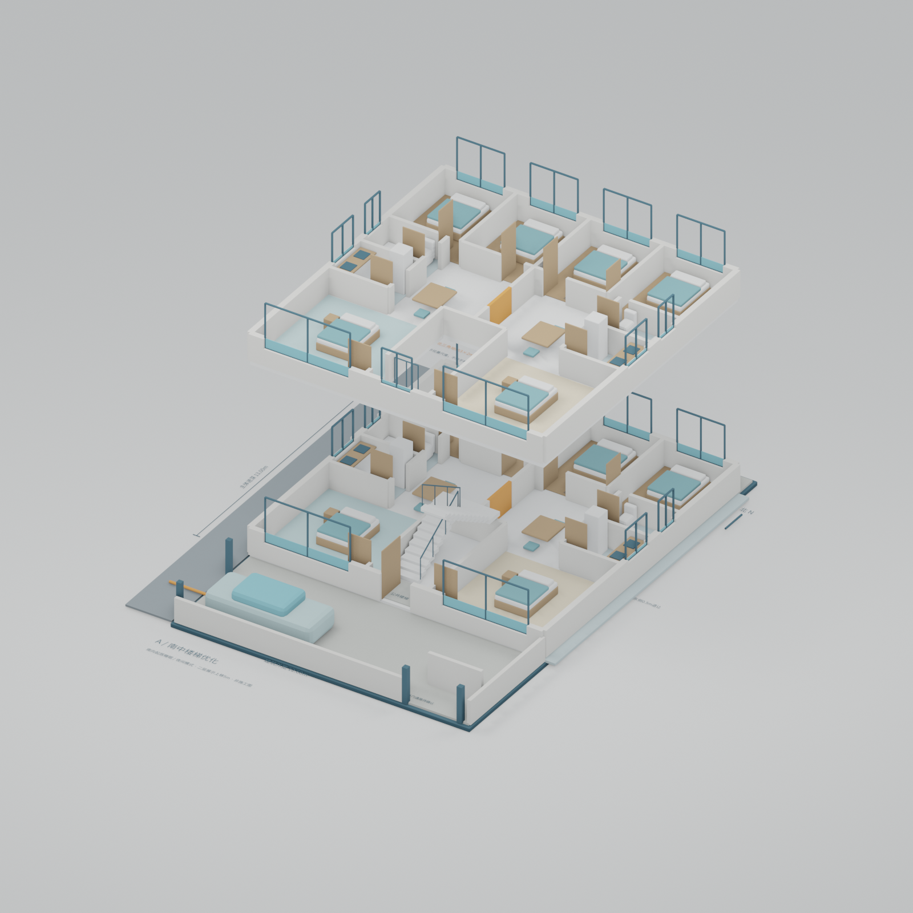
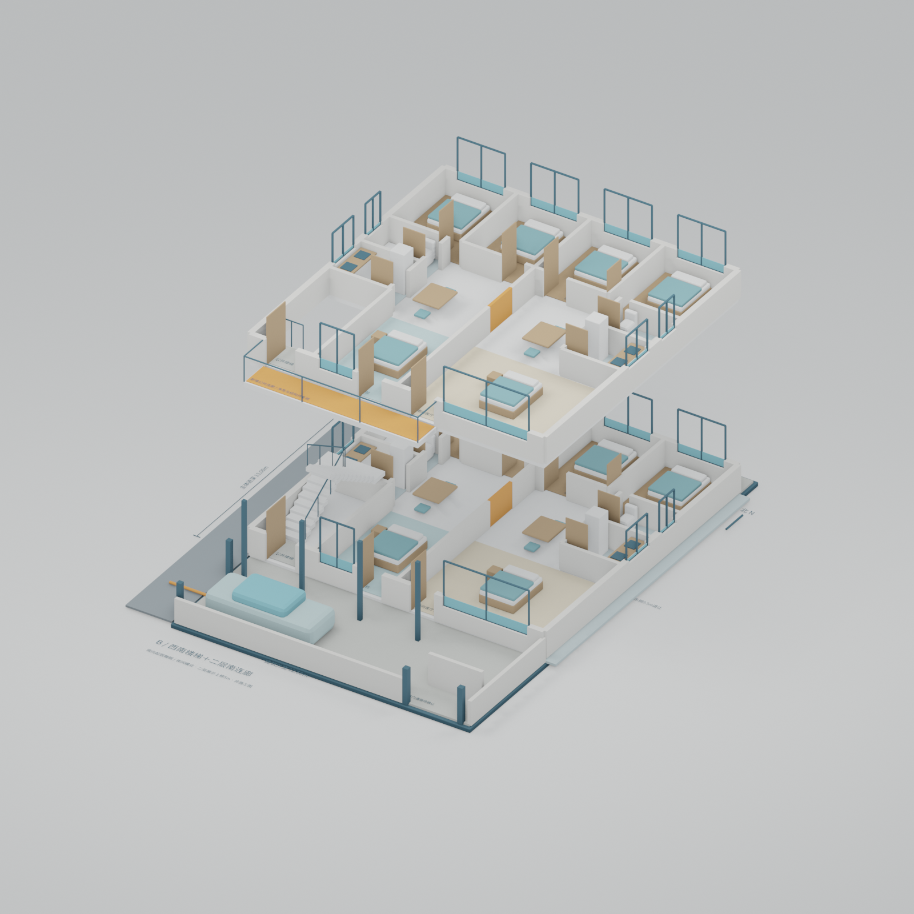
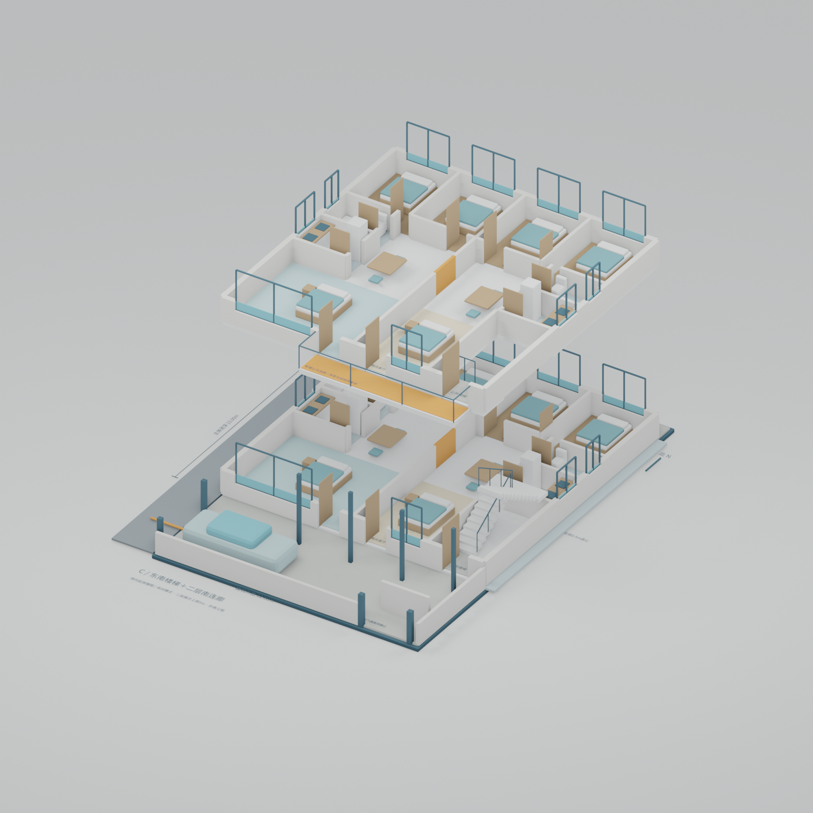
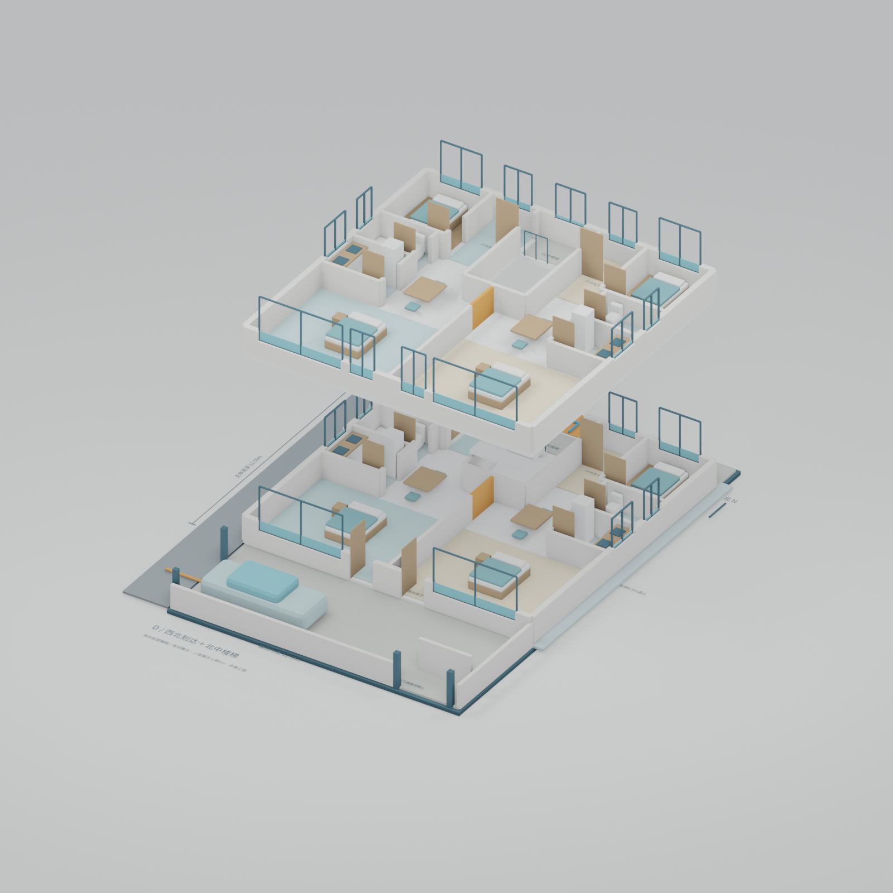

# B-2｜R2 四方案比选与施工方询价说明

**用途：拿同一套条件向施工方询价，比较面积、动线和新增工程。不是施工放样图或结构报价最终依据。**

## 先看这些文件

- [可打印报价比选册 PDF](报价比选册.pdf)
- [浏览器版报价比选册](报价比选册.html)
- [四方案一层对比总图](../../previews/comparison_r2/compare_floor1.png)
- [四方案二层对比总图](../../previews/comparison_r2/compare_floor2.png)
- [四方案轴测对比总图](../../previews/comparison_r2/compare_axon.png)
- [分项报价填写表 CSV](四方案分项报价表.csv)
- [业主已确认条件及方案参数](options.json)

## 1. 这一轮已经确认的条件

1. **建筑外宽12.6m固定，退让均在建筑尺寸之外。** 东侧0.5m是额外退让，不从12.6m内扣除。
2. 两户不要求完全对称。
3. 每户保留南向客厅兼备用卧室，可长期睡眠并适合老人；不强求独立南卧加独立南客厅。
4. 西侧中段不新增入户口。西南、东南上楼从现有南院组织；西北方案研究从道路西北端到达北侧楼梯。
5. 西北外有约南北2m、东西3m的三角空地，向房屋正北中部收窄。其准确轮廓、权属及与北退让带的重合范围未测定。
6. 北、东自然采光均较弱，南侧最好；西侧道路的实际噪声、采光和开口条件仍需现场核对。

本轮模型把西北空地画为**橙色三角形尺度提示**。约3×2m的直角三角形仅约3㎡，不是把“收窄到房屋北侧中部”的真实边界推算出来；不能据此砌墙、布楼梯、计算土方或认为可扩大用地。D方案的通行依托另行腾出的北侧1.5m带，不把该三角形当作已经确认可建的楼梯用地。

## 2. 四个方案的核心区别

| 项目 | A 南中楼梯优化 | B 西南楼梯 | C 东南楼梯 | D 西北到达＋北中楼梯 |
|---|---|---|---|---|
| 主体外尺寸 | 12.6×13m | 12.6×13m | 12.6×13m | 12.6×12.5m |
| 北退让 / 南院 | 1m / 5m | 1m / 5m | 1m / 5m | 1.5m / 5m |
| 南北总长 | 19m | 19m | 19m | 19m |
| 两层主体投影 | 327.6㎡ | 327.6㎡ | 327.6㎡ | 315㎡ |
| 楼梯参考占地 | 2.7×5.2m | 同左 | 同左 | 同左，移到主体北中部 |
| 每层西/东南房参考开间 | 4.95 / 4.95m | 3.6 / 6.3m | 6.3 / 3.6m | 6.3 / 6.3m |
| 每层南向起居睡眠房 | 2间 | 2间 | 2间 | 2间 |
| 每层北侧独立客卧 | 4间 | 4间 | 4间 | 2间，内侧改户内玄关 |
| 二层新增公共连廊 | 无 | 约7.45×1.25m | 同左，方向镜像 | 无南侧二层连廊 |
| 北侧到达通道 | 检修为主 | 检修为主 | 检修为主 | 1.5m退让带内组织步行到达 |
| 新增道路中段门 | 无 | 无 | 无 | 无；在西北端组织到达 |

表中开间、楼梯和连廊都是**参考范围，不是扣除墙厚、栏杆及饰面后的有效净宽**。楼梯从R1约2.3m参考宽增加到2.7m，是为净宽复核留出更合理的空间，不表示已完成规范与结构校核。所有方案楼梯暂按层间高3.4m、20级、参考踏面280mm表现，净高、完成面、平台、扶手和梁板仍须出专项图。

## 3. A｜南中楼梯优化：低成本基准

**组织方式：**南院→中央公共入口→一层两户；二层到公共平台后左右分户。南向两间房默认显示床展开的夜间模式，日间可收起成为客厅。

**优点**
- 公共交通最集中，无长二层外连廊；围护和分户逻辑简单。
- 两户南向开间接近，均保留可靠的南侧窗。
- 继续维持厨卫上下对位和中部合户口。

**代价**
- 楼梯仍占南向立面；相比3.6m的角部窄户方案，两户比较均衡，但南房不如D完整。
- 每户还有两间北客卧，是否有必要保留这么多弱采光房间，需按实际使用人数决定。

**报价定位：**作为所有施工方必须先报的基准方案。其他方案的增加项、减少项都与A比较。

## 4. B｜西南楼梯＋二层南连廊

**组织方式：**西侧院门进入南院；一层两户直接从各自南门入户。西南楼梯有独立的院内门；二层通过南侧公共连廊到各户门。楼梯在建筑主体内，没有堵住西侧院子的车行入口。

**为什么必须把连廊画出来：**若只把楼梯挪到西南，却仍让二层另一户独立入户，就需要公共连接路线；不能让东户穿越西户客厅。这个方案用外连廊明确承担该功能。

**优点**
- 上楼与西侧院门位置较近。
- 东户获得6.3m参考南向开间；西户仍有南窗与可展开床位。

**代价**
- 西户南房参考开间缩为3.6m，西户南窗也较窄，两户品质不完全一致。
- 新增二层连廊约9.31㎡参考投影，以及支承、栏杆、屋盖、排水、防滑与冬季防护。
- 连廊遮挡部分一层南向采光，二层房间临公共经过路线，需考虑隐私。
- 连廊构造和基础会增加费用；不应因为主体面积没变就按A的单价包干。

**报价定位：**把连廊完整系统单列。不能只报价一块板或一条钢梁，漏掉支承、连接、屋盖、雨水和防护。

## 5. C｜东南楼梯＋二层南连廊

**组织方式：**同样从西侧院门进南院，再走到东南楼梯门；两户一层独立南向入户，二层经公共连廊入户。**不依赖东南外门之外存在合法道路**，即使东南外门未启用也能从自家院内上楼。

**优点**
- 西户保留更完整南向空间，可同时研究利用西侧较开敞条件。
- 西侧车行入院和上楼人流位置较容易区分，但还需实际车行轨迹验证。

**代价**
- 东户原本侧向采光弱，又承担楼梯占用，南房缩为3.6m；若希望两户居住品质相近，这一方案尤其需要慎重。
- 与B相同的连廊及雨雪防护成本。
- 从主要西侧院门上楼需要穿过院子，通道不能被停车或影壁阻挡。

**报价定位：**几何增加项与B相近，施工方可比较西南/东南的基础、管线和施工操作差异，不能假定必然同价。

## 6. D｜西北到达＋北中楼梯：释放南向面积

**组织方式：**保留西侧南院门用于两户一层日常入户与车辆；到二层时，从道路西北端到达北侧步行带，进入北中公共楼梯。两层均可从楼梯侧门进入各户玄关；一层还保留各户南门。

**为什么不是把楼梯塞进西北三角地：**空地的面积及形状不支持现在认定能布置常规楼梯。楼梯仍在主体内，三角地最多作为待确认的到达缓冲空间。

**平面调整：**主体进深从13m减为12.5m，北带从1m增为1.5m，南院5m不变，总长仍19m。北侧内侧两间原客卧改为分户玄关与进出路线，每户保留一间外侧北客卧；两户南向房均获得6.3m参考开间。

**优点**
- 南向面积更完整，两户使用品质比较均衡。
- 两层主体简单投影少12.6㎡。
- 没有B/C的二层南连廊，对一层南窗的额外遮挡更少。
- 主楼梯与南院生活、停车动线分开。

**代价及成立条件**
- 二层到达绕到北侧，对老人、雨雪天和夜间照明的要求更高；一层养老仍优先走南院路线。
- 必须确认道路西北端的到达路径和北侧带均在可使用范围内，不能借邻地通行。
- 北带1.5m为总参考宽，扣墙脚、排水设施、保温完成面和门扇影响后净通行仍须核对。
- 北侧通道雨雪遮蔽、防滑、照明、排水及围护边界单列；模型默认隐藏其屋盖以便看清平面，不代表可以漏报。
- 北客卧减少为每户一间；这些客卧的采光条件仍需复核，不能因为名称改为“客卧”就降低居住要求。
- 二层租赁场景下公共路径与疏散要求须由当地设计核对，不把示意流线当作已通过审查。

**报价定位：**重点比较“减少12.6㎡主体的费用”与“新增北侧到达、雨雪防护和排水的费用”。不能直接断言D最便宜。

## 7. 当前建议排序

- **优先深化A与D。** A作为施工简单、集中入户的经济基线；D作为改善南向居住质量的重点备选。
- 若北侧到达权属、净宽、雨雪防护难以解决，优先回到A，而不是依赖三角空地硬做狭窄楼梯。
- B、C说明角部楼梯的真实代价，适合让施工方报出连廊完整差价。B/C都不自动比A更省公共面积。
- 若选择角部楼梯，需由业主明确更希望哪一户获得完整南向开间；东侧本来较弱，C对东户的影响通常更需要补偿。

## 8. 怎样拿给施工方报价

### 8.1 给每个施工方完全相同的资料

1. 本比选册及A—D一层、二层平面图。
2. `四方案分项报价表.csv`。
3. 场地实测资料（尚未补齐的标高、地基、出口注明暂列）。
4. 统一装修标准：普通墙地面、标准门窗、简单厨房、常规洁具；一层散热器、二层地暖；可维护明装管线。

要求施工方分别写明：材料与人工范围、计量规则、暂列项、工期、是否含设备和调试、哪些工程尚需正式图纸才能报价。

### 8.2 数量表能用到什么程度

已知几何可先用于估算比较：主体投影、南院/北带面积、楼梯参考范围、连廊参考长宽、窗洞参考面积。模型自动导出的墙表和洞口表可帮助检查漏项。

不能直接从模型确定：基础形式与方量、钢筋、梁柱/梯板/连廊板厚、混凝土强度、挡土、屋面真实坡面积、门窗最终性能、供暖容量、管径与管线长度、泵容量及合法排放连接。

**避免重复计价：**楼梯参考占地已在主体投影内，不得再次加到主体面积中；连廊另列，但最终建筑面积计量以当地规则为准。墙表在墙交接、梁柱占位和洞口扣减上不是结算工程量。合户填充在洞口表标为预留连接口，封堵填充及结构洞口各自报价，不能漏项。

### 8.3 每个方案都要报价的公共底线

场地与排水、两层结构、楼梯与栏杆、屋面和保温、防潮防水、门窗安装、四户及公共用电、给排水、供暖、出租分户要求、入住必需的照明防滑设施。分期装修不能省略正在使用的公共通行和防护。

## 9. 文件及编辑方法

| 方案 | Blender | 一层 | 二层 |
|---|---|---|---|
| A | [A_comparison.blend](../../models/comparison_r2/A_comparison.blend) | [平面](../../previews/comparison_r2/A_floor1.png) | [平面](../../previews/comparison_r2/A_floor2.png) |
| B | [B_comparison.blend](../../models/comparison_r2/B_comparison.blend) | [平面](../../previews/comparison_r2/B_floor1.png) | [平面](../../previews/comparison_r2/B_floor2.png) |
| C | [C_comparison.blend](../../models/comparison_r2/C_comparison.blend) | [平面](../../previews/comparison_r2/C_floor1.png) | [平面](../../previews/comparison_r2/C_floor2.png) |
| D | [D_comparison.blend](../../models/comparison_r2/D_comparison.blend) | [平面](../../previews/comparison_r2/D_floor1.png) | [平面](../../previews/comparison_r2/D_floor2.png) |

- `F1_`、`F2_`为两层。默认二层上移5m便于看内部；实际层间高暂定3.4m。
- 南房默认启用`South_NIGHT_MODE`床展开状态。关闭它并启用`South_DAY_MODE`可查看日间沙发状态，不能同时把两种家具当作同时可放。
- `Walls_upper_ENABLE_FOR_FULL_HEIGHT`可恢复完整墙高；`MERGE_INFILL`标出未来可拆填充。
- B/C连廊天气防护、D北通道屋盖为独立的默认隐藏集合，需要按现场合法范围和结构细化。
- 用`恢复实际层间关系.py`可将当前比较模型的二层从展示偏移恢复到实际层间关系；建议另存副本后执行。
- 重建脚本：`scripts/build_comparison_r2.py`。从JSON读取方案参数，但不是任意拖动尺寸都能自动解决平面问题的建筑设计系统，重大尺寸更改须同步重排房间与楼梯。

## 10. 决策前还差什么

1. 实测西北三角地及北侧路径轮廓，确认D到达条件。
2. 确认每户“一间北客卧＋南向起居睡眠”是否够用，决定D减少客卧是否可接受。
3. 同一家施工方先报A和D，再单列B/C连廊完整差价。
4. 初选后只深化一个主方案及一个备选，再做结构、采光、楼梯净高净宽、标高排水和完整设备图。
