# B-2 农村两层住宅｜设计与施工准备说明

**版本：R1 · 2026-09-20**  
**目标：先经济入住；两层各两户；多年后每层可合并为一家自用；维护方便；适度适老；防潮、节能。**

**后续讨论更新：**业主已明确北侧采光较差、东侧有0.5m预退让但采光也差、南侧采光最好。原四间北卧及南中楼梯需重新比较，详见[采光约束与平面改进评估](discussions/02_采光约束与平面改进评估.md)。下文及模型仍记录R1方案，不代表已落实新平面；东侧0.5m与固定12.6m宽度的关系待确认。此前的[高价值投入讨论](discussions/01_高价值投入优先级.md)已独立归档。

> 阅读约定：**【已知】**来自业主；**【暂定】**用于本版排布和模型，施工前复核；**【待定】**缺少现场或专业设计数据。图中路线、层次和设备符号用于交底；未标出的配筋、基础尺寸、坡度、管径不应从模型猜测。

## 目录

1. [结论与优先决策](#1-结论与优先决策)
2. [场地、标高、入口与排水](#2-场地标高入口与排水)
3. [平面、尺寸及两层关系](#3-平面尺寸及两层关系)
4. [分户、合户与适老](#4-分户合户与适老)
5. [结构与屋面选择](#5-结构与屋面选择)
6. [明装给排水、电气与采暖](#6-明装给排水电气与采暖)
7. [防潮、防水、保温与门窗](#7-防潮防水保温与门窗)
8. [最小入住、预算与采购](#8-最小入住预算与采购)
9. [施工顺序和过程检查](#9-施工顺序和过程检查)
10. [交付、维护与模型使用](#10-交付维护与模型使用)
11. [开工前待确认表](#11-开工前待确认表)

## 1. 结论与优先决策

### 1.1 本版推荐

- 保留 **12.6m × 13m** 主体、北1m、南5m，总19m。先解决排水和层高，不为节省很少面积而立即压缩院子。
- 一层、二层均维持东西两户；北侧四卧室；厨卫上下对齐；共用南中楼梯。
- 将卫生间南隔墙从原草图约Y=7.60调整至 **Y=7.15m【暂定】**，借厨房约0.45m，提升卫生间可用性。
- 中部分户墙只预留 **1.50m宽 × 2.40m高【暂定】** 的未来连接口，先封为有隔声性能的非承重墙；不用追求整面墙可拆。
- 生活与人车入口优先从西侧道路解决；东南门须确认通路权属，未确认时保留关闭接口。
- 东南设可检修集水点，但**合法排放方向优先于自然低点**；污水另行确定去向。
- 两层结构、屋面、外门窗、防水、主要管线接口一次完成；室内按一户、两户、四户分期完成。
- 一层散热器、二层地暖分别设供暖分区；热源按当地能源与热负荷选择，不提前指定功率或管径。

### 1.2 已知边界与面积

| 条件 | 当前信息 | 设计影响 |
|---|---|---|
| 面宽 | 【已知】12.6m，不能调整 | 开间需在此范围内分配；不能靠向邻地外扩解决 |
| 南北总长 | 【已知】19m | 北退让+房屋+南院必须等于19m |
| 当前分配 | 【暂定】1+13+5m | 坐标Y=-5到14；南墙Y=0、北墙Y=13 |
| 周边 | 西道路，其余三侧邻居 | 东南门、东西厨卫窗、北窗采光均需核实边界与邻房 |
| 场地高差 | 北高南低、西高东低，西至东南约1m | 不能直接照平地院子施工；需标高测量与土方比较 |
| 气候 | 北方，会下雪，不特别冷 | 仍须确定城市、冬季设计温度、冻深、雪荷载 |
| 采暖 | 一层散热器、二层地暖 | 末端温度不同，需要水力与温控协调 |
| 主体投影 | 12.6×13=163.8㎡/层 | 两层简单投影327.6㎡，非正式报建面积 |
| 院子/北带 | 63㎡ / 12.6㎡ | 室外总计75.6㎡，与主体合计239.4㎡ |

单户套内面积不能简单用163.8÷2：须扣外墙、分户墙、楼梯及公用部分。工程计量应使用最终图纸。

### 1.3 “省钱”排序

**先花钱**：地基与排水、结构、屋面防水、外维护保温、门窗安装、防潮、卫生间排水、埋地套管、合户洞口结构。  
**用普通可靠产品**：室内涂料、标准门、基础洁具、明装线槽、成品散热器、简易厨房台面。  
**可后做**：全套橱柜、装饰吊顶、昂贵地砖、景观树、影壁饰面、院内大面积精铺、未入住户家具。  
**不能因分期而缺失**：正在使用区域的栏杆、扶手、照明、电气保护、排水、防水和冬季防冻。

## 2. 场地、标高、入口与排水

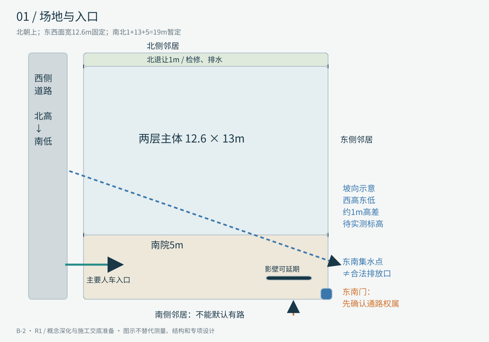

### 2.1 先做一张实测标高表

选定道路或固定构筑物上的稳定基准点BM，记录其相对标高；不要把“道路=0”与模型中的Z=0混用。

| 测点 | 要记录的内容 | 用途 |
|---|---|---|
| 西侧道路北、中、南三点 | 路面高程、路拱、沟底、历史积水线 | 判断入院倒灌与重力排水可能 |
| 宅基地四角及主体四角 | 自然地坪高程 | 土方、地坪、挡土边界 |
| 计划车门与人行门 | 路面、门槛、门内地坪 | 车辆通过与少台阶入户 |
| 东南低点 | 地坪、可接管底标高、井深、权属 | 决定重力排水还是提升 |
| 北侧、东侧邻房 | 墙脚、基础可见情况、地坪、落水口 | 防止回填推挤与邻水流入 |
| 原水井、化粪池、地下管线 | 位置、埋深、可用性 | 避让、施工与污水方案 |

本版不指定室内±0.000的绝对标高，也不把约1m全部计入某个入口。**先测量，再比较土方和挡土成本。**

### 2.2 场地处理推荐逻辑

优先比较“主体地坪平整、靠西入口设置平顺接入、院子分级找坡”的方案。院地不必全部与最高道路等高，也不宜直接整体随自然坡倾斜。

- 房屋地坪为稳定水平面；基础随地基条件设计，不靠未压实回填承载。
- 靠房屋设置可靠散水及排水路径；不能让外部水沿台阶或门口流入室内。
- 东侧较低处若需挡土，应独立设计排水、稳定与边界；**围墙不能默认兼作挡土墙**。
- 避免回填土直接抵住邻房墙体或高于邻房防潮层。
- 北侧1m保留检修和排水，种植采用可移花盆或离墙独立花槽。

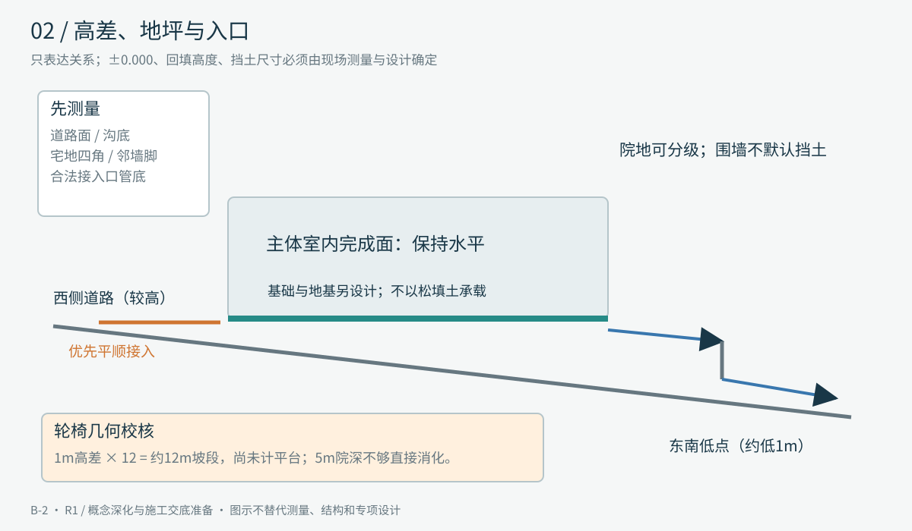

### 2.3 轮椅与车辆不能只看院子有多宽

如果将来必须消化完整1m高差，按1:12作几何估算，仅坡段就需要约12m，尚不含平台；**5m深院子不能直接做一条短陡坡解决**。这不是本项目最终坡道设计坡度，应按当地要求和实际落差确定。

当前优先：将主要步行路线安排在靠西道路、与主入口标高尽量接近的位置；剩余高差通过院地分级处理。测量后核对“道路→西侧门→南院→中央入口”全程净宽、转弯、排水和防滑。

车位示意不代表已验证能开进去。西侧道路宽度、车门净宽、门柱、转弯半径、车长、车辆底盘与纵坡必须实车或轨迹校核。院内停车不能堵住两户入口和老人步行路径。建议将车辆开口净宽3.3m作为校核起点，而不是已经确定的有效净宽。

### 2.4 雨水系统：先确认出口

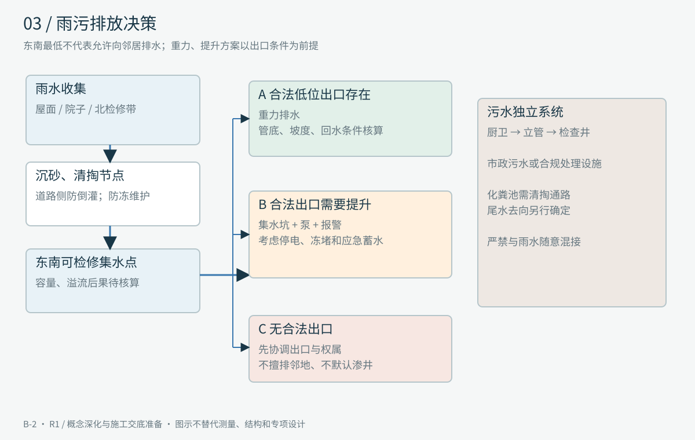

**雨水路线：**屋面天沟/落水管、庭院线性沟、北侧检修带 → 沉砂或可清掏节点 → 东南可检修集水点 → 合法出口。

- 方案A：若合法接入口管底足够低，按实测高差设计重力排放；应核算管道坡度、出口回水与防冻。
- 方案B：若无法重力排到合法出口，设置可检修集水坑和提升系统，回排至允许的接入口；预留电源、液位报警、止回与检修空间，运行可靠性按积水后果确定。
- 方案C：若没有获准出口，先解决排水去向和权属，再定永久标高；不能把出水口指向东邻、南邻或默认渗井消纳。
- 泵扬程、流量、坑容积、沟宽、管径按汇水面积、当地暴雨强度和出口条件计算。本版不填臆测数值。
- 提升方案必须考虑停电、泵故障及冻堵时的临时蓄水和受控应急路径，不允许溢流穿过住宅或未经同意流向邻地。
- 道路侧设拦水/截水节点，同时保证车行与轮椅经过；井盖、篦子应有相应承载能力。
- 污水与雨水分开。无市政污水时，化粪池位置、容积、防渗、清掏通路及尾水去向另行落实；化粪池本身不是最终排放许可。

### 2.5 东南门及侧窗的现实约束

南侧有邻居，因此东南大门仅在具备合法通路时作为外门使用。未确认前，西门同时承担人行、车行入口，影壁可以简化或延期。不能通过默认“南侧还有一条路”来完成动线。

厨卫位于两端并不自动意味着外窗可开：西侧道路边界、东侧邻房间距、防火间距、隐私、采光与通风均要核实。若东侧不能合法开窗，应改为合规机械排风，经独立竖向管道到屋面；**机械排风不能替代卧室应有的合法采光条件**。北侧1m也不等于北侧四卧室的采光已经合格，必须测邻房距离和高度。

## 3. 平面、尺寸及两层关系

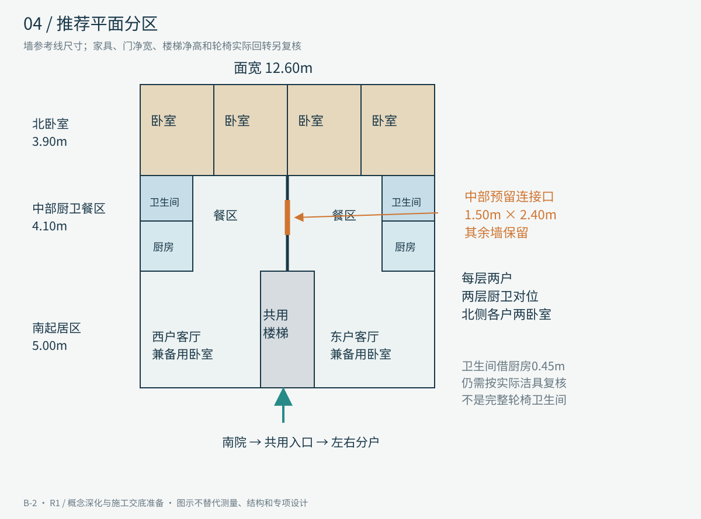

### 3.1 坐标和空间带

模型X轴向东、Y轴向北。X=-6.3～6.3；房屋南墙Y=0、北墙Y=13。尺寸以墙体参考线为主，**净尺寸须扣墙厚和饰面**。

| 区域 | 参考范围【暂定】 | 作用及核对点 |
|---|---|---|
| 南侧客厅/备用老人卧室 | Y=0～5 | 每户主起居；暖气、床位和沙发不能互相占位 |
| 共用楼梯间 | X约±1.15，Y=0～5 | 门洞、扶手及梯梁会进一步影响净宽 |
| 中部厨房带 | Y=5～7.15 | 比原方案缩短约0.45m；标准单排台面优先 |
| 中部卫生间带 | Y=7.15～9.1 | 外墙侧每户一间，改善使用空间 |
| 北卧室带 | Y=9.1～13 | 四间并排，每间参考开间3.15m |
| 厨卫侧带 | X=-6.3～-4.05及4.05～6.3 | 参考宽2.25m，扣墙及饰面后核算洁具 |
| 未来合户口 | 中轴X=0，Y=6.55～8.05 | 宽1.5m，高2.4m；管线避开 |

典型卧室参考净宽约3.15−0.08−0.08=2.99m，边间受外墙厚度影响略有不同。北卧室净进深约3.9−0.12−0.08=3.70m，饰面另扣。1.5m床的两侧通道需要与柜深联合排布；模型家具仅表示可用性，不能直接下单定制。

卫生间调整后参考净深约1.95−0.08−0.08=1.79m；侧带参考净宽约2.25−0.12−0.08=2.05m。约2.05×1.79m仍不是已经满足轮椅回转和侧向移位的无障碍卫生间，属于改善型预留。后期有明确需求时可进一步借厨房面积。

### 3.2 二层组织

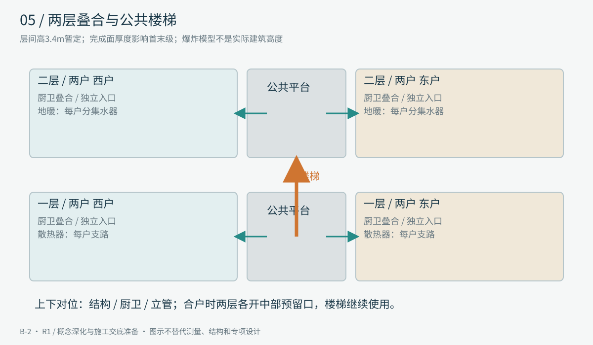

- 二层优先与一层完全对位，避免厕所在卧室正上方、排水横穿卧室。
- 楼梯到二层先到公共平台，再从左右门进户；不穿过任一户客厅去另一户。
- 阶段模型补充二层楼板楼梯洞口及到达平台；洞口边梁、栏杆、净高由结构与建筑共同确定。
- 地暖需要保温层、管道层和保护层，具体厚度由系统与地面材料设计。**楼梯起终踏步必须按完成面计算**，不能只按结构板顶。
- 二层合户后可保留一个日常入口，另一个保留检修或按最终设计处理；不能擅自封堵需要保留的通行出口。
- 若未来整栋一家使用，两层各自合户即可，共用楼梯仍成为家庭内部楼梯，尽量避免改动结构。

### 3.3 楼梯专项复核

当前模型层间高3.4m、20级、每级约170mm、踏面约280mm，只是比例排布。两跑各10级并不自动证明各项尺寸已经满足要求。

必须核对：
1. 完成面标高及所有踏步等高；地暖厚度变化不能形成异形首末级。
2. 每跑扶手之间净宽、平台净宽、门扇开启空间。
3. 梯段下、平台下、梁下有效净高；不能从剖顶图判断。
4. 梯梁/梯板、平台梁和楼板洞口结构关系。
5. 二层平台和洞口防护；儿童防攀爬与扶手连续性。
6. 楼梯间的采光、常亮/感应照明、应急照明及与出租用途相关的当地要求。

对2.3m参考宽楼梯间应特别关注：两侧墙厚、中间缝和两侧扶手扣除后，每跑净宽可能不足。若复核不足，优先将楼梯间适当加宽并局部调整客厅，而非强行缩踏步。具体放样由最终楼梯详图决定。

### 3.4 南北长度调整的三个算术方案

| 方案 | 北带+主体+南院 | 两层主体投影 | 代价/收益 |
|---|---|---:|---|
| A 本版 | 1+13+5=19m | 327.6㎡ | 最接近草图，保留当前排布 |
| B 院子优先 | 1+12.5+5.5=19m | 315㎡ | 少12.6㎡主体；楼梯/客厅需重排，室外施工面积增多 |
| C 主体更紧凑 | 1+12+6=19m | 302.4㎡ | 少25.2㎡主体；不能直接按比例压缩全部房间 |

预算比较须用“减少的主体造价−增加的室外与土方造价”；未确定当地单价不直接报节约金额。北退让是否可减少还受审批、采光、检修和邻里边界限制，不能只按19m总长调节。

## 4. 分户、合户与适老

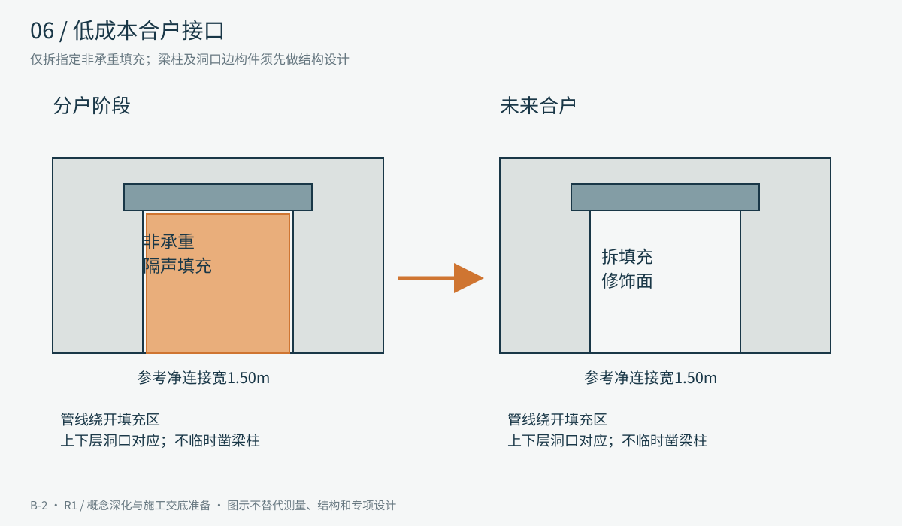

### 4.1 合户接口做法

- 中部只保留一个1.5m参考连接口。结构设计先考虑洞口上方承重与侧边构件，施工时形成完整结构洞口。
- 分户期间用满足隔声和耐久要求的非承重填充封闭，边界在图上、竣工照片和现场标识中一致记录。
- 不在填充墙里放配电箱、主管、地暖分集水器；明线也应绕洞口顶部或两侧固定结构走。
- 洞口两侧和楼地面完成面尽量一致；地暖各自分区，不需要跨未来洞口串接回路。
- 日后拆除只涉及指定填充、局部饰面与门套，不拆梁柱、不凿承重墙；根据实际成墙体系安排支护和拆除工序。
- 阶段05打开两层指定填充，保留原分户阀表。合户不要求立刻合并电表与供暖回路，可减少改造量。

“可拆”与“隔声”不矛盾，但应选当地工人容易做好的常规墙体体系，并明确材料、连接、封边和隔声要求；不凭墙体厚度估算隔声性能。

### 4.2 适老的低成本预留

| 现在就做 | 将来按需做 |
|---|---|
| 主路线尽量少台阶、湿区防滑、照明充分 | 扶手、淋浴座椅等设备安装 |
| 门洞按有利于净通行的尺寸留设 | 局部更换门扇/滑门，必要时扩卫生间 |
| 常用开关插座布置便于站立与坐姿操作 | 电动床、呼叫设备 |
| 卫生间扶手位置做可靠基层并拍照 | 按具体使用者身高和照护方式安装 |
| 南客厅预留床位、插座、遮光 | 加隔断变老人卧室 |
| 入口和走廊避免被柜子、车、设备侵占 | 合并一层，改善照护流线 |

门洞目标：主要通行门可先按**完成后净宽不小于约0.90m的设计目标**校核；有照护或轮椅要求的具体门、通道、转弯应按当地规范与实际器具进一步确定。模型旧门扇与洞口仍含比例示意，不能把0.90m门扇当0.90m有效净宽。

卫生间优先外开或紧急可开启门、无尖锐突出五金；设置可控缓坡和排水，避免简单取消挡水条后洗澡水流出室外。

### 4.3 出租使用的独立性

每户独立入户门、阀门、配电箱、采暖分区和网络接口。公共楼梯与院门独立回路，公共水电费用可清晰分摊。厨卫排风避免串味；排水通气不能接厨房排油烟。租赁用途涉及的消防、疏散、防火分隔等由当地设计要求确定，模型中的四户排布不等于已完成相关审查。

## 5. 结构与屋面选择

### 5.1 常规结构优先，不跨专业猜配筋

向当地设计人员和施工队提供相同平面，比较熟悉的合规结构体系。比较内容包含：地基、基础、抗震构造、砌体或框架、梁板、楼梯、洞口预留、人工和模板，不只比较每平方米主体口头报价。

- 上下层墙、柱、厨卫对位；北侧3.15m参考开间和南中楼梯共同协调轴网。
- 分户中轴可能恰是重要承重线，不能因为想合户就省去梁柱；先设计洞口，再选择填充。
- 南侧大窗、卧室门、两户入口上方都要有正确的受力构造。
- 回填较厚或地基不均匀时重点处理沉降；南院独立构筑物与主体连接需考虑差异变形。
- 不把后期“再加一层”作为默认能力；若有真实增层需求，必须现在按最终荷载设计。

### 5.2 屋面：先把排雪、保温、检修想清楚

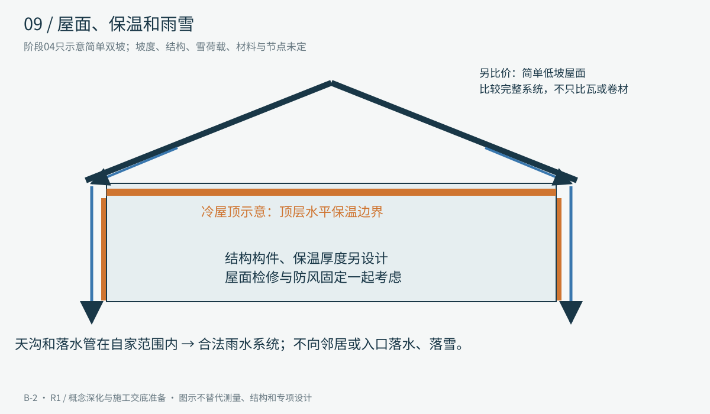

阶段04用简单双坡屋面演示体形与天沟。坡度、屋架截面、雪荷载、瓦材固定、抗风及检修承载均未设计。屋脊沿南北，水向东西天沟汇集，原因是示意避免北侧狭窄带成为主要落雪区；**并不表示允许向东邻排水或落雪**。

两种报价应对比完整系统：

| 简单双坡 | 简单低坡/平屋面 |
|---|---|
| 坡面排水明确，可设通风冷屋顶 | 体形简洁，设备布置方便 |
| 需屋架、覆盖材料、防风和天沟 | 需可靠找坡、保温、防水、收头与溢流 |
| 防雪滑落、天沟结冰要处理 | 积雪、积水与排水口维护要处理 |
| 冷屋顶时保温可在顶层顶棚/楼板形成连续边界 | 保温防水层次按当地常规成熟体系设计 |

无论哪种，雨雪必须收集到宅基地内合法系统；屋檐、天沟、保温完成面不能未经确认越界。南入口上方避免直接落雪/冰；需要时采用适合屋面系统的挡雪措施。屋面只有一种清晰热边界，避免施工队同时随意在多个层次铺膜而困住水汽。

## 6. 明装给排水电气与采暖

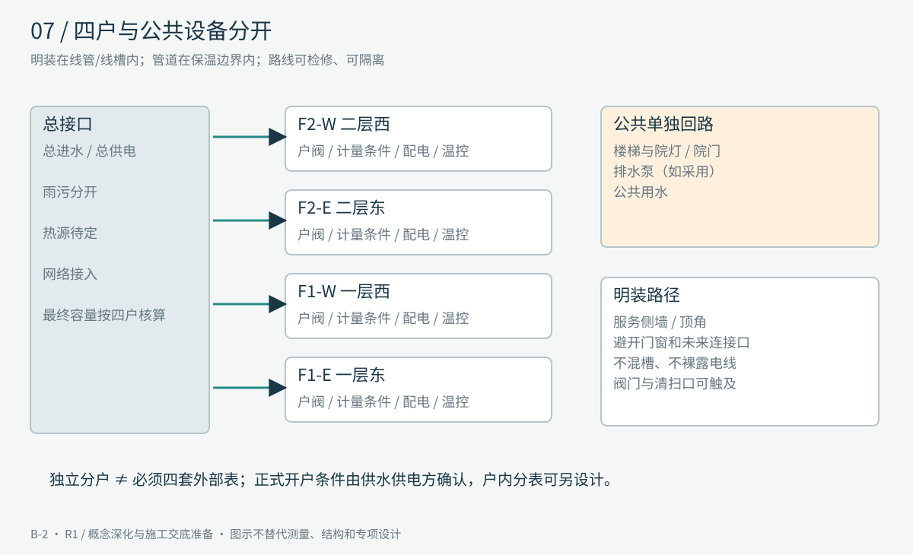

### 6.1 明装的原则

明装适合低成本和维护，但应“成排、有固定、可识别、可隔离”，不是裸线裸管随意跨门。优先沿厨卫服务侧、走廊顶角或可拆检修盖板走线；少做整屋吊顶。

- 管线放在室内保温边界以内，北方不能因检修方便就放外墙外侧。
- 电线在线管/线槽内，强弱电合理分离；湿区设备和接线位置符合使用环境要求。
- 水电避免同槽混放；穿墙/板预留套管，封堵与隔声、防火要求配套。
- 所有阀门、活接、清扫口、设备过滤器可触及，不封死在柜后。
- 标签至少包含楼层、户号、用途、流向；例如`F2-E-HEAT-S`为二层东户采暖供水。
- 走线不穿未来合户填充，不妨碍门窗开启和净通行。

### 6.2 给水与热水

总进水 → 可检修总阀/过滤与计量条件 → 四户分支阀表 → 各户厨房、卫生间、热水设备；公共用水另设分支。实际是否能申请四套外部表计由供水方决定，户内分表与供水公司正式计量不能混为一谈。

热水优先短距离就近供应，减少长管等待和无谓循环损耗；热源类型结合电力、燃气及当地允许条件。穿室外和非采暖区的水管防冻；长期空置户应具备隔离与排水维护条件。给水卫生、回流防护、压力及水锤由设备和给水设计确定。

### 6.3 排水、通气与排风

- 每侧厨卫上下对位，立管靠服务区，独立可拆检修包覆；不把排污立管贴卧室床头。
- 污废水能否合流、管径、横支管坡度、清扫口位置按设计确定，避免水平长距离绕楼梯。
- 通气按合规方式到屋面，屋面收口可靠；不能用封闭末端或厨房排风管代替。
- 地漏水封需维护，少用房间防止蒸发返味；洗衣机排水位置预留水封和防溢条件。
- 二层卫生间是否局部降板，须在结构前确定；不允许入住后为排管随意凿梁板。
- 厨房排油烟、卫生间排风、排水通气分开；多户共用竖井须用合规系统避免串味和火烟传播。
- 图中东西侧外部雨污主干仅作路径提示；若用地没有侧向操作空间，应在基础协调后移入可检修服务带，严禁为放管越界。

### 6.4 一层散热器、二层地暖

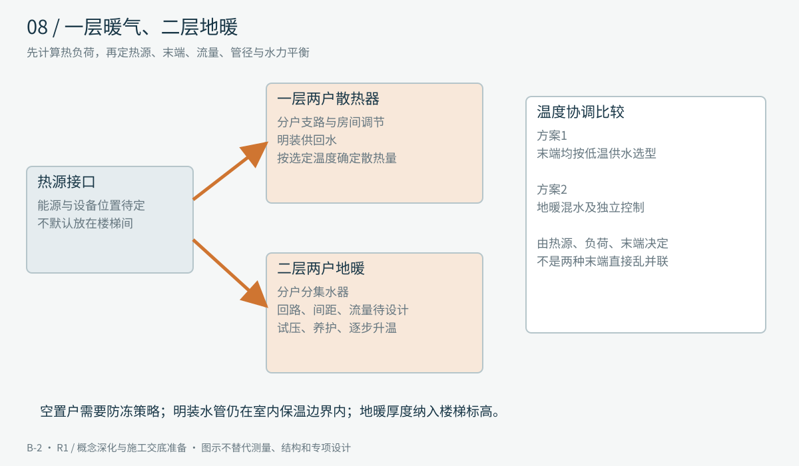

先按当地冬季设计温度、朝向、门窗、保温、使用时段计算各房间热负荷，再确定热源和末端容量。

- 一层两户分别设置可调散热器支路，房间可调节；供回水沿服务侧或踢脚上方有序明装。考虑放床后不遮挡散热器，不把高温表面安排在老人易碰触位置。
- 二层每户独立分集水器、房间回路和控制；分集水器位于可检修处，保留阀门操作空间。
- 散热器与地暖可能需要不同供水温度。可比较“末端均按低温供水选型”和“热源供水+地暖混水控制”两种系统；不是机械地认定一定需要或不需要混水。
- 地暖回路长度、间距、分区、流量和水力平衡按计算；不能直接把模型色线当铺管图。
- 填充层施工前进行压力试验并记录，铺设和养护期间按系统要求保护与监测；地面养护完成后逐步升温，禁止突然高温烘干。
- 一层若散热器、二层地暖施工厚度不同，楼梯、门口、卫生间标高统一协调。
- 不常住户的低温运行或放空方案按当地最低温度、系统形式设计；防冻液不得随意使用。
- 热源若涉及燃烧设备，须按燃料类型设置合规独立设备位置、燃烧空气与排烟；不能默认装在共用楼梯间。本版模型只画接口。

### 6.5 电气与弱电

总供电容量按四户最终使用、采暖热源、电热水、厨房及可能的提升泵校核；分期入住不能把入户主线按一户简单缩小。

每户独立配电箱，照明、普通插座、厨房、卫生间/热水、空调或电采暖等按负荷分回路。公共楼梯、院门、室外照明、排水泵单列；保护接地、等电位、漏电保护、防雷等由电气设计落实。不同户零线与保护导体不能随意混接。

预留网络箱位置和到各户的穿线通路；监控位置关注公共区域与邻居隐私。明装槽尽量按标准长度和统一水平线安装，减少零碎弯头与后期混乱。

## 7. 防潮防水保温与门窗

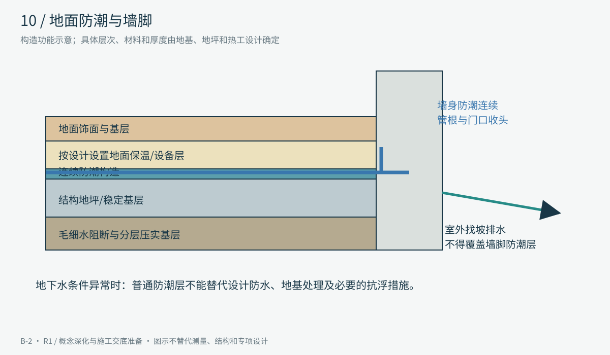

### 7.1 地面和墙脚

自下而上的功能层通常包含稳定基层、阻断毛细水的层次、连续防潮构造、按地区选用的保温及地面层。具体材料、厚度、位置应结合结构地坪和采暖设计，不能把此处示意顺序直接套用于所有地基。

- 防潮层搭接、上翻和墙身水平防潮连续；柱、管根、门槛是薄弱点。
- 外墙脚高程与室外地面配合，避免室外铺砖抬高后覆盖防潮构造。
- 回填分层压实，保留材料、厚度、压实检测记录。
- 若地下水位高或有承压水，普通“防潮膜”不能替代经设计的防水和抗浮措施。
- 室内完工前充分干燥；不要在潮湿基层上直接封闭木作与不透气饰面。

### 7.2 厨卫湿区

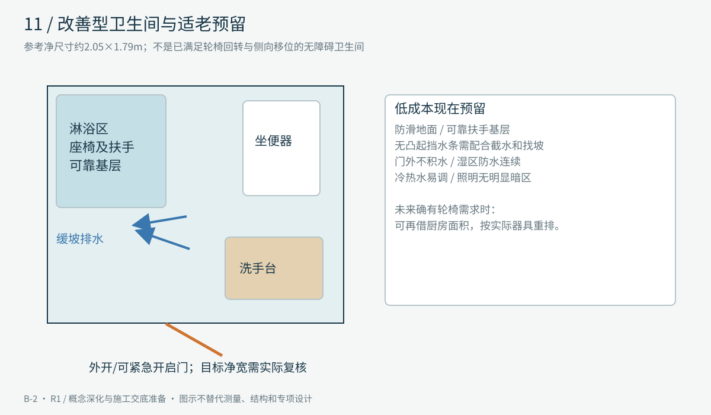

基层 → 阴阳角、管根等细部处理 → 经选定体系要求施工的防水层 → 保护与饰面。墙面防水高度、门口收头、淋浴区范围按实际体系和设计确定，不在本版用同一固定高度替代。

先确认地漏位置和坡向，再做防水和饰面；防水完成按规定进行蓄水等检查，检查楼下、相邻墙与管根。饰面后再次通水核查“排得走、不倒坡、门外不积水”。隐蔽验收拍照标出测量尺。

扶手固定到可靠基层，不能只固定在瓷砖和薄板上。老人无门槛淋浴需要足够的坡度组织与截水措施，不是省略防水收头。

### 7.3 连续保温与结露

- 屋顶与外墙保温优先，窗边、梁柱、楼板边、檐口连续处理。
- 北侧卧室外墙家具适当离墙，结合供暖与通风控制结露。
- 保温层厚度由所在地节能设计及材料导热参数确定；不按“北方但不太冷”随意给统一厚度。
- 采用内保温或复杂层次时，要核查结露和水汽迁移；优先采用当地成熟、配套节点完整的系统。
- 外保温防火、固定、抗风、饰面、墙脚抗冲击与防水作为同一系统采购。
- 阴雨潮湿天气不以长时间开窗作为唯一除湿措施；采暖季短时有效通风，必要时机械换气，兼顾能耗。

### 7.4 门窗、遮阳和气密

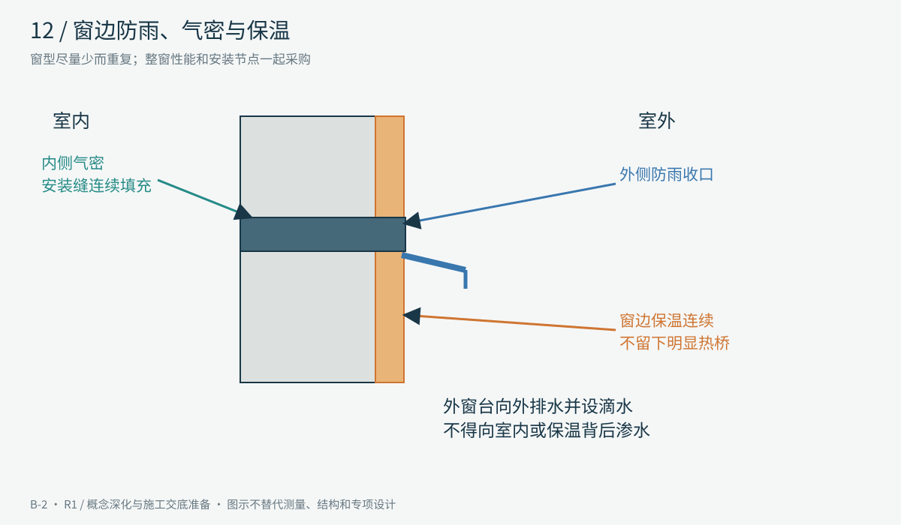

南窗保留较好采光，但开口面积和结构相协调；北窗按采光和保温折中，不追求整面玻璃；东西厨卫窗以必要开口为主。优先减少窗型和尺寸类别，选当地维修方便的常规产品。

招采不能只写“双层玻璃”：应明确整窗热工、气密、水密、抗风压及五金要求，玻璃安全要求随位置确定。安装缝填充、室内气密、室外防雨、窗台泛水滴水和保温收口一起交底。

南向外遮阳按纬度和窗高确定，使夏季减少直晒、冬季利用日照；在最终位置未知前，不固定挑檐长度。窗扇设置足够可开启面积、纱窗和方便清洁的形式。睡觉关闭卧室门时，不应把开门穿堂风当唯一换气来源。

## 8. 最小入住预算与采购

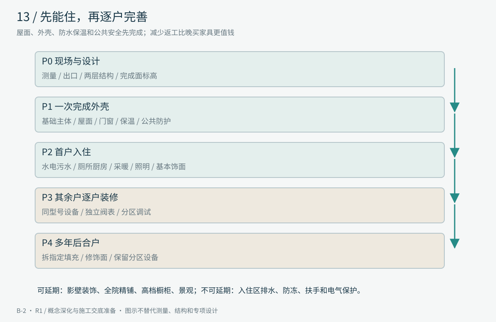

### 8.1 分期方案

| 阶段 | 必须完成 | 可以延期 |
|---|---|---|
| P0 现场与设计 | 测量、地基判断、合法排水出口、两层结构与楼梯、计量与管线接口 | 立面装饰选择 |
| P1 外壳一次完成 | 地基基础、两层主体、屋面、外门窗、防水保温、公共楼梯防护、主要雨污和供电接口 | 未住户室内精装 |
| P2 最小入住 | 至少一户安全供电、供水、卫生间、简单厨房、采暖、照明、可关闭门窗、排污；公共通道完整 | 家具升级、全院铺装、景观 |
| P3 按需出租 | 其余户逐户完成洁具、厨房、供暖控制、户内线路及计量 | 统一高档装饰 |
| P4 多年后合户 | 拆指定填充、修饰洞口、调整家具和分区控制 | 合并全部设备系统 |

二层地暖可按户分期铺，但对应完成面厚度、门洞、楼梯终点和管路套管应在P0确定。未铺地暖区域保持干燥封闭，不能在已完成楼板上随意改变结构。未入住楼层不得向入住区落水、落物或留无防护洞口。

### 8.2 不报虚假总价，先建立可比清单

| 分项 | 计量依据 | 报价必须说清 |
|---|---|---|
| 测量与设计 | 工作范围/成果份数 | 是否含结构、排水、楼梯及现场交底 |
| 土方与挡土 | 实测挖填方、运距、挡土图 | 含不含弃土、压实、降排水 |
| 基础与结构 | 正式结构图工程量 | 钢筋、混凝土、模板、脚手及检测 |
| 屋面完整系统 | 实际坡面/投影计量规则 | 保温、防水、天沟、收边、防雪、防风 |
| 墙体与保温 | 墙面积扣洞口规则 | 材料、系统配件、窗边梁柱节点 |
| 门窗 | 分规格数量与面积 | 玻璃、五金、安装密封、纱窗 |
| 水电与采暖 | 点位表、回路表、设备表 | 暗埋/明装范围、阀表、保温、测试 |
| 室内基本装修 | 实际地墙面积 | 基层、找平、防水与面层是否分别计价 |
| 室外与排水 | 沟管井长度/数量 | 井盖等级、泵、电源、合法接驳及冻深 |

预算表达：`总额 = 已明确工程量×对应含人工材料单价 + 未定项暂列金额 + 风险预备金`。预备金随地基、土方、出口等不确定性调整，未调查前不要承诺一个固定比例就够。

同一套图纸至少做可对比报价，重点比清单缺项和施工范围，不只比每平方米数字。合同应约定材料替代确认、隐蔽记录、检测、变更计价和保修，不用“按常规施工”代替关键节点。

### 8.3 标准化采购建议

门窗控制为少数重复规格；厨卫两侧镜像，洁具与阀件尽量同型号；墙面以普通耐擦洗涂料、地面以常规耐磨防滑材料为主；厨房先标准单排台面+成品设备，少做复杂转角；明装线槽、管卡、阀门标签统一规格。楼梯踏面材料耐磨防滑，优先实用而非大面积石材装饰。

## 9. 施工顺序和过程检查

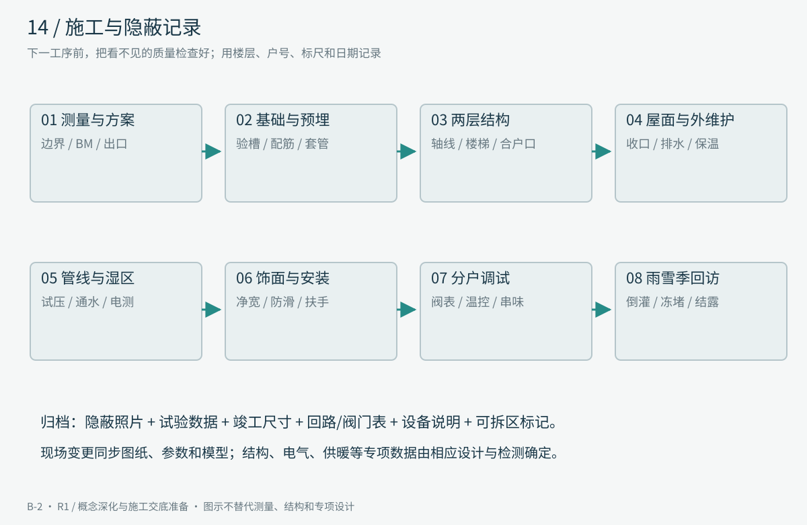

| 顺序 | 施工/准备事项 | 下一步前检查 | 应保留记录 |
|---|---|---|---|
| 01 | 边界、邻房、地下管线、标高调查 | 面宽与19m边界、入口、出口 | 测量图、带标尺照片、BM位置 |
| 02 | 两层图纸及结构、排水协调 | 合户口、楼梯、厨卫降板、套管 | 协调版图纸与变更清单 |
| 03 | 临时排水、开挖、验槽 | 实际土质、地下水、邻基影响 | 验槽和地基处理记录 |
| 04 | 基础、预埋、回填 | 配筋、位置、保护层、回填压实 | 隐蔽照片与检测 |
| 05 | 两层结构与楼梯 | 轴线、标高、洞口、平台、预留 | 每层尺寸复核、混凝土资料 |
| 06 | 屋面与外维护 | 排水坡向、收口、保温连续 | 淋水/蓄水等适用检查记录 |
| 07 | 门窗与外部排水 | 安装缝、窗台、沟井通畅 | 雨后观察、安装照片 |
| 08 | 水电、排污、采暖 | 阀表、绝缘接地、试压、通水 | 回路/管线编号、测量数据 |
| 09 | 湿区防水与地暖地面 | 蓄水、地暖试验、完成面标高 | 隐蔽照片和记录 |
| 10 | 基础饰面、洁具、扶手 | 防滑、门净宽、排水不倒坡 | 点位实测与整改清单 |
| 11 | 分户调试与试住 | 供暖平衡、噪声串味、公共设施 | 各户阀表读数、设备资料 |
| 12 | 首场大雨/首次冬季回访 | 地坪、屋面、窗边、冻堵、结露 | 回访问题闭环 |

### 9.1 施工队交底时逐项确认

- 所有尺寸说清“轴线、结构面还是装修完成面”。
- 门洞不是门扇净宽，楼梯净宽不是墙中线距离。
- 楼梯按两层完成面做放样；模型的20级仅作校核起点。
- 合户口不得临时改成承重砖墙；结构不允许的位置不得现场开洞。
- 防水、采暖、电线管、给排水的交叉顺序预先确定。
- 室外铺装不能后来抬高淹没墙脚防潮层。
- 不允许把雨水、污水、油烟、排水通气混接。
- 未确认合法排水出口前，不做永久封闭的排水终点。

### 9.2 适合业主现场检查的直观项目

带卷尺核对实际房间与门洞；用水检查卫生间、窗台、院地是否倒坡；查看井盖能否打开、清扫口是否被封；逐户关阀断电，确认不会影响邻户和公共照明；开关门窗检查与家具、散热器冲突；夜间从院门走到卫生间检查暗区。结构和电气等专业检测由具备相应能力的人员完成，业主观察不能代替检测。

## 10. 交付维护与模型使用

### 10.1 阶段模型

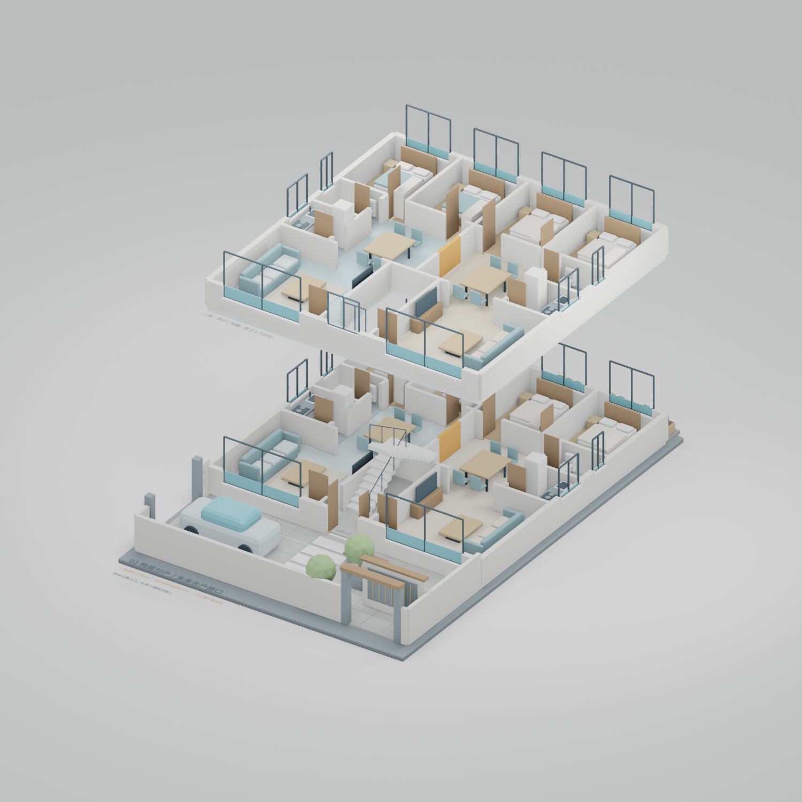

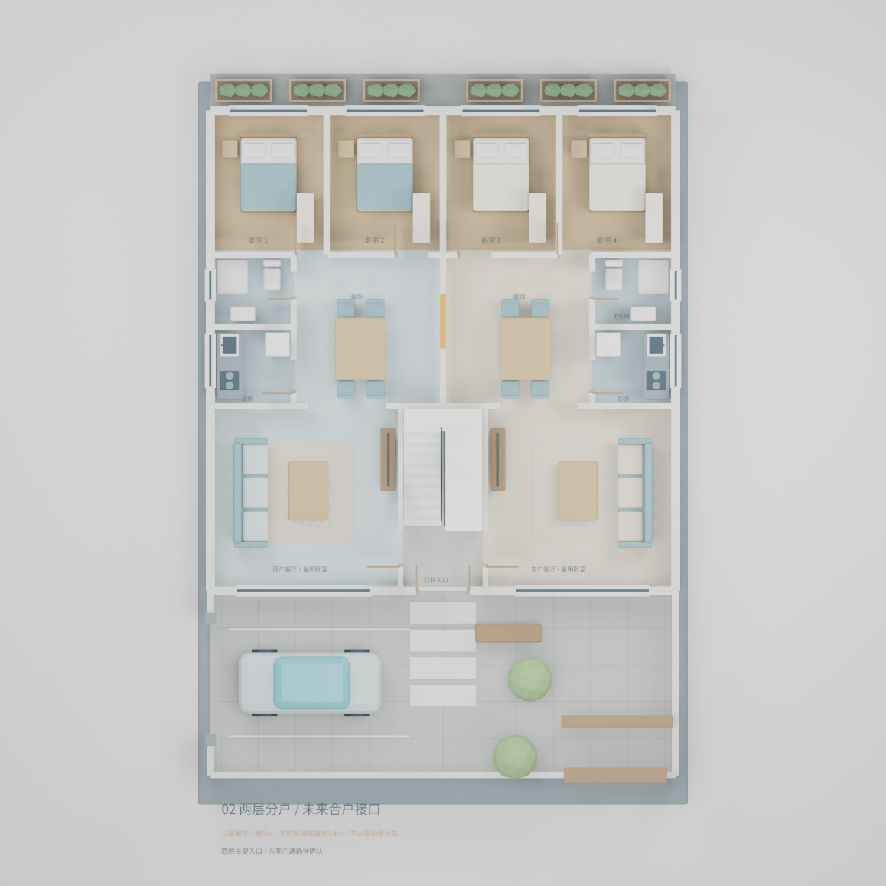

| 阶段 | 可编辑文件 | 图像 | 说明 |
|---|---|---|---|
| 01 场地 | [01_site_drainage.blend](../models/01_site_drainage.blend) | [预览](../previews/01_site_drainage.png) | 坡向和集水条件，不是测绘地形 |
| 02 两层分户 | [02_two_households.blend](../models/02_two_households.blend) | [轴测](../previews/02_two_households.png)、[一层平面](../previews/02_ground_plan.png) | 卫生间扩大、限定合户口、二层平台；爆炸展示 |
| 03 明装管线 | [03_exposed_services.blend](../models/03_exposed_services.blend) | [预览](../previews/03_exposed_services.png) | 雨污、给水、电气、采暖接口与分户 |
| 04 外维护 | [04_envelope_roof.blend](../models/04_envelope_roof.blend) | [预览](../previews/04_envelope_roof.png) | 全高墙、屋面体形；结构未定 |
| 05 未来合户 | [05_future_merge.blend](../models/05_future_merge.blend) | [预览](../previews/05_future_merge.png) | 两层拆除指定填充，保留管线分区 |

二层分层展示默认上移5m，以免遮住一层；模型中所有`L2_`集合对象共用这一展示偏移。阶段04已恢复实际层间关系。阶段02/03/05附文字提示和自定义属性，量层高须看参数，不从爆炸视图直接测量。墙体上部集合用于切换剖切；屋面与线路可独立隐藏。

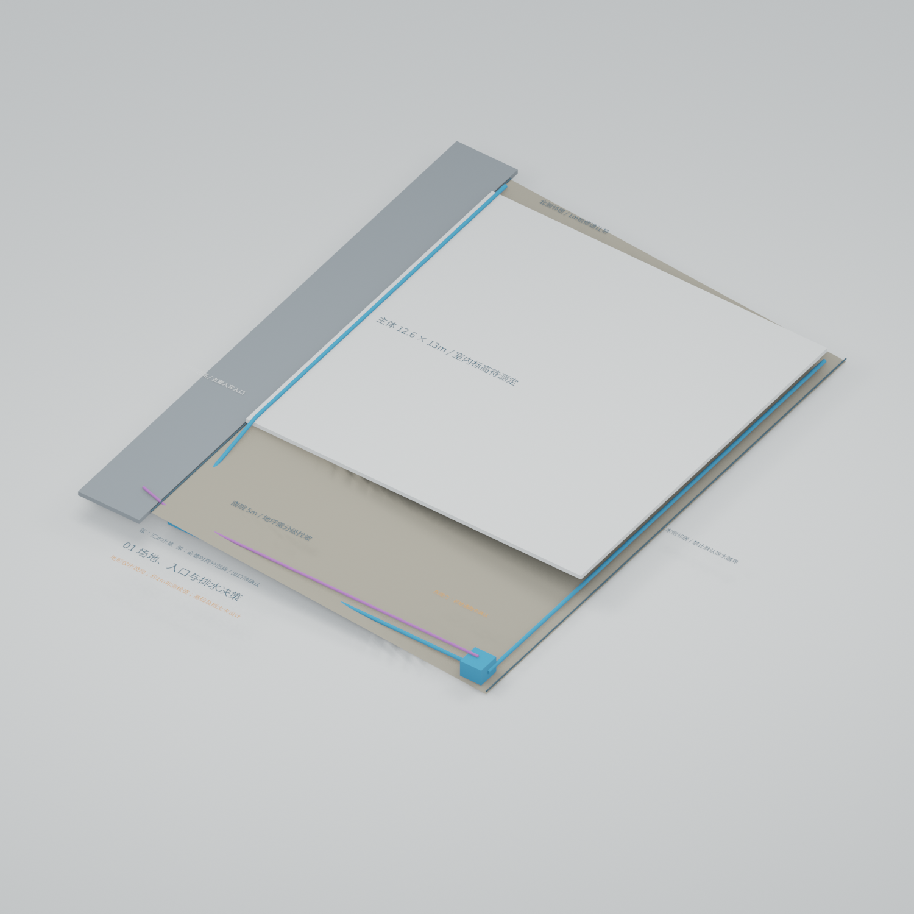

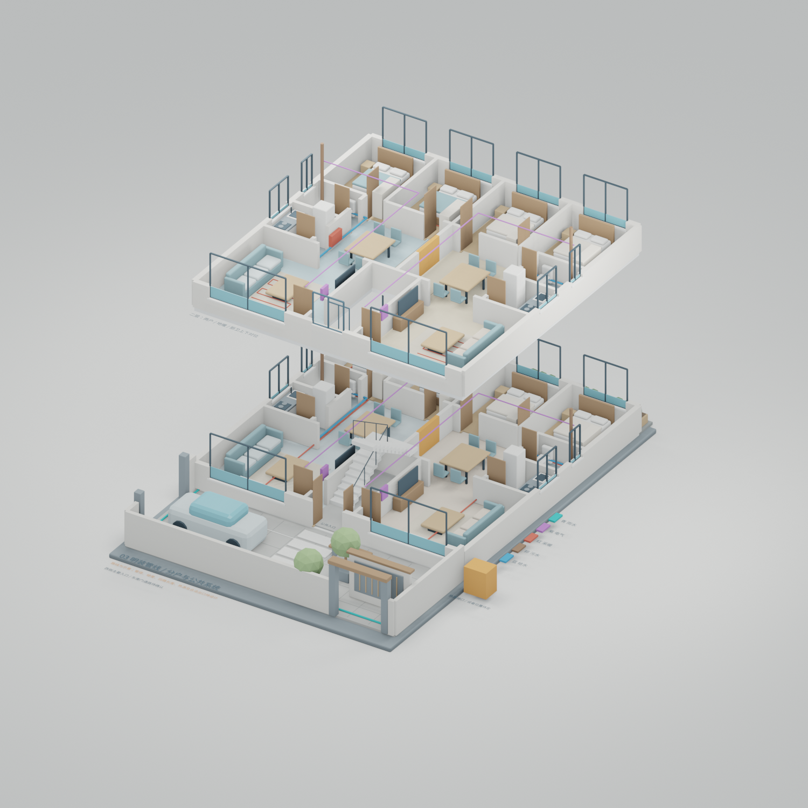

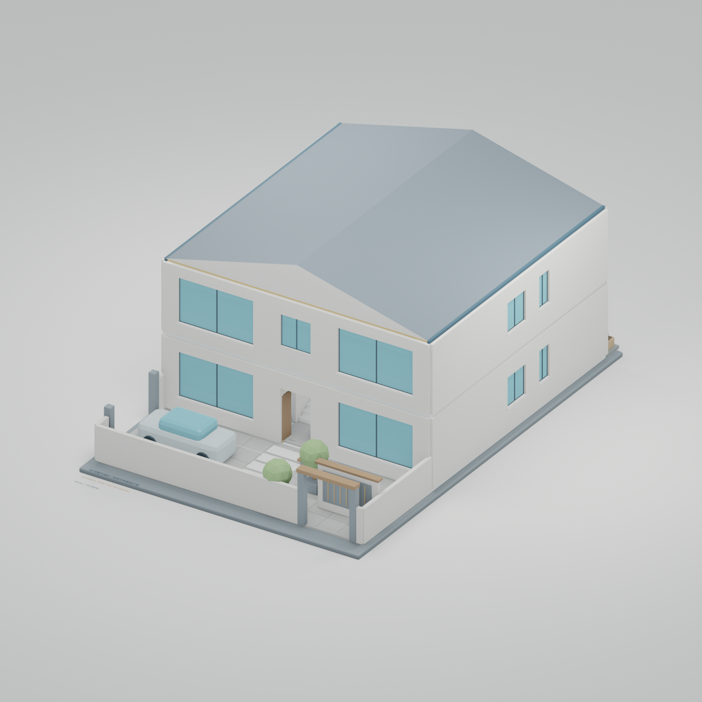

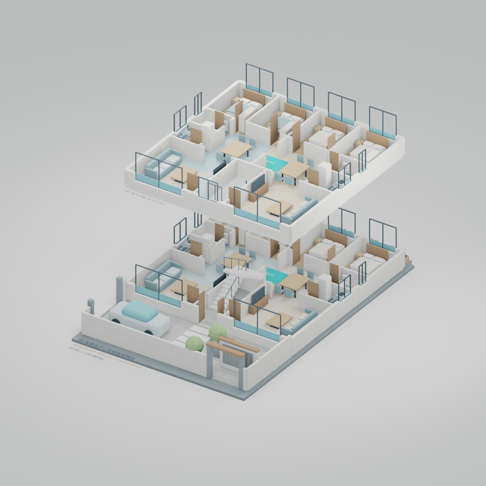

模型基于原一层概念家具，门窗、楼梯、洁具为尺度示意。二层地暖线只作回路位置符号；没有完整铺管长度、间距和水力计算。阶段模型没有声称完成承重构件、基础、挡土、排水出口和冻深设计。

### 10.2 交房资料应有

竣工尺寸图、墙内/地面隐蔽照片、线路回路表、阀门图、材料型号、设备说明、试验记录、屋面检修说明、排水泵控制说明（如采用）、合户可拆区照片及尺寸、维修联系人。

建议每张隐蔽照片带楼层户号和标尺，存入`records/日期-工序/`；涉及业主隐私的凭证另行管理，不放公共仓库。每次实际变更应同步Markdown、参数和模型，而非只保存聊天记录。

### 10.3 维护频率提示

雨季前清沟清井、检查屋面落水；入冬前检查暴露水管和排水防冻、调试采暖；大雪后观察檐口落雪与天沟结冰，不随意上屋面；空置户定期维护水封和防冻状态；明装管卡、阀门、线槽松动及时处理。具体频率服从设备手册和当地气候。

## 11. 开工前待确认表

| ID | 必须确认的事项 | 当前状态 | 影响的成果 |
|---|---|---|---|
| Q01 | 县市、冬季设计温度、雪荷载、冻深 | 待定 | 结构、保温、采暖、埋管 |
| Q02 | 土地红线、规划、邻房距离高度 | 待定 | 侧窗、北卧室采光、檐口、东南门 |
| Q03 | 实测场地及道路、沟底高程 | 待定 | ±0.000、土方、挡土、入口 |
| Q04 | 合法雨水出口位置与管底 | 待定 | 重力/提升、集水坑、应急路径 |
| Q05 | 污水设施与排放去向 | 待定 | 立管、埋管、化粪池及清掏 |
| Q06 | 地基土、地下水、原基础 | 待定 | 基础、回填、地坪防潮 |
| Q07 | 两层结构体系、合户洞口 | 待设计 | 梁柱、配筋、抗震、施工图 |
| Q08 | 楼梯净宽净高、完成面厚度 | 待复核 | 楼梯间尺寸、平台及户门 |
| Q09 | 电力容量、燃料条件和热源位置 | 待定 | 供暖、电气、设备费用 |
| Q10 | 预算上限、首批入住哪几户 | 待业主决定 | 分期与清单报价 |
| Q11 | 西路宽度、车辆尺寸、入口通行 | 待测 | 车门、车道坡度、庭院布局 |
| Q12 | 租赁用途对应的当地要求 | 待确认 | 防火、疏散、分户与设施 |

**下一轮最小输入：县市名称、一张带道路与邻房位置的边界测量图、道路/宅地/排水口实测高程、首批入住户数及可用预算。** 这几项可以明显缩小土方、保温采暖和分期方案的不确定性。

可直接填写：[现场测量记录模板](现场测量记录模板.csv)、[报价对比模板](报价对比模板.csv)。报价表中已填的面积只是当前方案几何量，不能替代合同计量；其余工程量和单价留空，避免先估后算造成误导。
